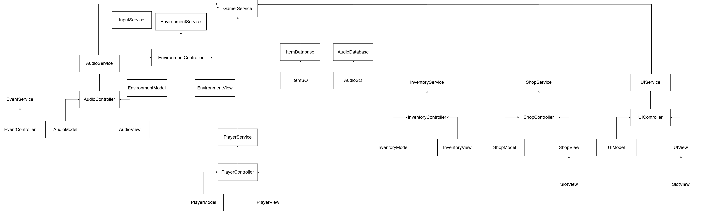

# 🛒 Unity Inventory System

# 🎥 WATCH THE DEMO VIDEO

---

## 🎮 Description

A simple inventory system built with Unity and C#.  
- **Features a shop system** for buying and selling items.  
- Includes a test player character (a cube) that can move and collect items spawned in the scene.  

---

## 🖼️ UML Diagram

  

### **Programming Features**  
- **MVC Pattern**  
- **Dependency Injection**  
- **Singleton Design Pattern**

---

## ⚙️ Features

1. **Player Character**  
   - A simple test cube that can pick up items.  

2. **Shop System**  
   - Ability to **buy items**.  
   - Ability to **sell items**.  

3. **Inventory Management**  
   - **Maximum Weight and Size** constraints for the inventory.  

4. **UI Feedback**  
   - Notifications for game events like:  
     - Inventory full in size or weight.  
     - Confirmation dialogs (Yes/No) for buying or selling items.  
     - Alerts for items purchased or sold.  
   - Top bar displaying:  
     - Player's money.  
     - Inventory size.  
     - Inventory weight.  

5. **Item Attributes**  
   - Each item has a **weight**.  
   - Inventory tracks the **total weight**.

---

## 🖼️ Screenshots

.png)

.png)  

.png)  

.png)  

.png) 

## 🎵 Music Track
RoleMusic - Juglar Street  
https://freemusicarchive.org/music/Rolemusic

Kenny Assets - Inventory Sounds

